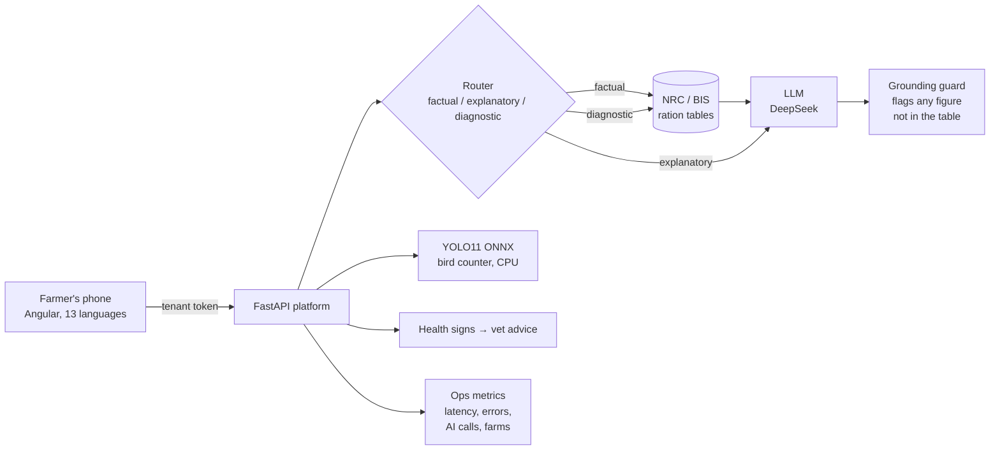

# 🐔 Poultry 360

**Live:** https://poultry-360.onrender.com · [](https://github.com/RavSinghChandan/poultry-360/actions/workflows/ci.yml)

An AI assistant for small Indian poultry farms. It counts birds from a photo or
video, says exactly how much to feed by age, and flags health signs that need a
vet, in 13 Indian languages, with read-aloud for farmers who do not read.

---

## The problem

A broiler farmer with 2,000 birds counts them by hand, guesses the feed, and
finds out about a sick flock when birds start dying. Feeding the wrong protein
at the wrong age stunts growth. Most of these farmers text in Hinglish, many do
not read comfortably, and they use a cheap Android phone on a weak network.

| Constraint | What it forced |
|---|---|
| A wrong feed number harms birds | Numbers come only from published tables (NRC 1994, BIS IS 1374). The model may explain a number, never originate one. |
| Farmers text in Hindi, English and Hinglish | A router built and measured on all three (see Evals). |
| Low literacy | Picture-first screens, 13 languages, read-aloud. |
| Cheap phones, free hosting | YOLO11 exported to ONNX, runs on a plain CPU; one Docker image. |
| An AI key that costs money | Signed tenant keys, daily caps per farm, per network and for the whole app. |

## Architecture



- **Harness, not prompt.** The model is one step in a loop the code controls: budget, validate, authorise, execute, trace. See [docs/ARCHITECTURE.md](docs/ARCHITECTURE.md).
- **Features are isolated.** Each feature is a package with its own routes and tools; a test parses every feature's imports and fails if one feature reaches into another. Adding a feature does not touch the platform.
- **Fails safe.** No AI key, a timeout or a bad reply never fails a farmer's request: the table answer is always returned, and the ops panel counts the fallback.

## Evals

Offline, free and repeatable (`python -m evals.run`), and run in CI with
floors that fail the build if a score drops.

| What is measured | Cases | First run | Now |
|---|---|---|---|
| Router picks the right path | 40 questions (EN 19, Hindi 8, Hinglish 13) | 78% (Hinglish 5/13) | **100%** |
| Router reads the bird's age | same 40 | 100% | **100%** |
| Guard catches an invented nutrient figure (recall) | 16 model replies | 78% | **100%** |
| Guard does not flag a correct figure (precision) | same 16 | 100% | **100%** |

The first run found two real bugs. Hinglish trouble reports ("meri 20 din ki
murgi kamzor hai") were routed as plain chart lookups, so the AI never saw that
the birds were sick. And the guard missed figures written after the nutrient
("protein around 21") or spelled out ("five percent"). Both are fixed.

*Honest limits:* the cases were written by me, and the fixes were made against
the same set, so "now" is an in-sample score. Bird-count accuracy is not yet
measured on a labelled set of real shed photos; that is the next eval.

## Running it

| | |
|---|---|
| **Ops panel** | `/admin` (admin key) shows API calls, server-error rate, AI calls, AI fallback rate, AI p95 latency, tokens, per-route p50/p95 and the farms active today. JSON at `GET /api/admin/ops`. |
| **Sign-in** | A farm registers at `/register`; the owner approves it at `/admin` and sends a signed tenant key + one-click link by WhatsApp. Keys are HMAC-signed, so they survive a free-tier restart. |
| **Limits** | Daily caps per farm (40), per network (60) and in total (400), set by environment variables. |
| **Health check** | `GET /api/health` reports each feature's self-check; a feature whose data fails validation is not served. |

## Integrating with a farm's other systems

Every feature is a plain HTTP API, documented at `/docs` (OpenAPI).

```bash
# Day-by-day feed plan as CSV, for a feed-mill order or the farm's spreadsheet
curl "https://poultry-360.onrender.com/api/feed/plan.csv?day_from=1&day_to=42&birds=2000" -o plan.csv

# The ration for one day, as JSON (needs a farm's sign-in token)
curl -X POST https://poultry-360.onrender.com/api/feed/ration \
  -H "Authorization: Bearer $TOKEN" -H "Content-Type: application/json" \
  -d '{"day": 17, "birds": 2000}'
```

## Run, test, deploy

```bash
./run.sh                                   # http://localhost:8000
.venv/bin/python -m pytest tests/ -q       # 230 tests
.venv/bin/python -m evals.run              # the evals above
```

One Docker image serves the API and the UI. On Render: **New → Blueprint →**
this repo ([render.yaml](render.yaml)), then add a `DEEPSEEK_API_KEY`.

## What is next

| Feature | Status |
|---|---|
| Ration by age, feed plan, CSV export | **live** |
| Bird count from photo or video (YOLO11, CPU) | **live** |
| Health signs → what to check, when to call a vet | **live** |
| Flock diary: age, alive, deaths | **live** (on the phone) |
| Count accuracy eval on labelled shed photos | next |
| Server-side flock records and FCR (needs a lasting database) | planned |
| Photo health scoring | planned |
